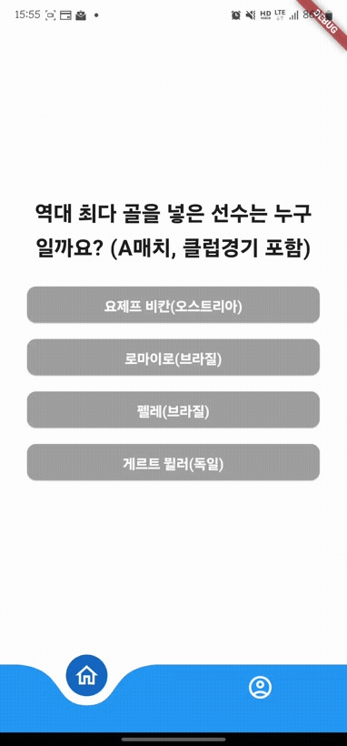
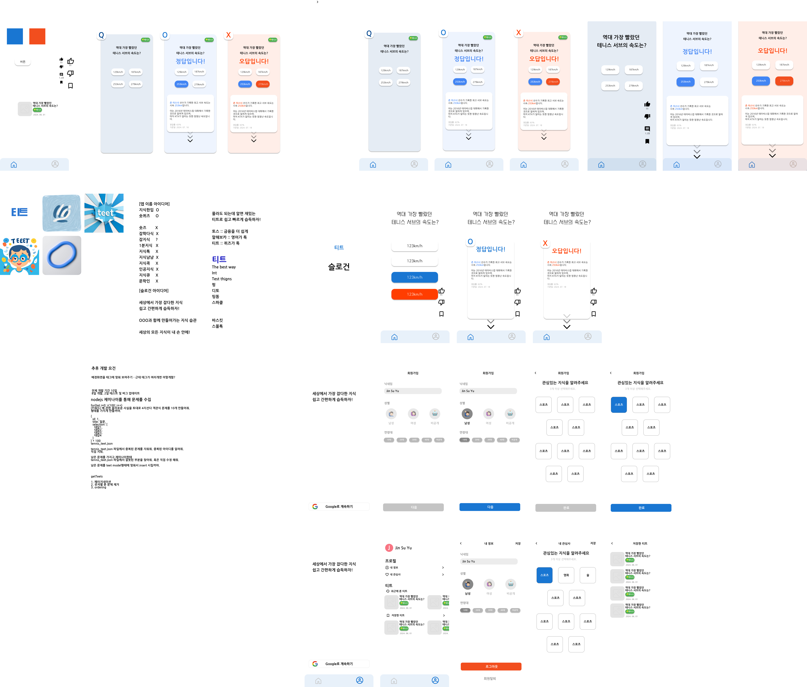

# TEET

10초에 하나씩 티트를 풀어가면 넓고 얕은 지식을 즐기세요

## Function

✅ 클린아키텍쳐를 지킴 (1w)

✅ 커서드 페이지네이션을 통한 무한 스크롤 구현 (1w)

✅ 회원가입 + 유저정보 업데이트 (2w)

✅ 광고 붙이기 (3w)

✅ 앱 아이콘 (3w)

✅ 유저별 개인화된 티트 제공

✅ 최근에 푼 티트, 좋아요 누른 티트 제공

✅ 배포

❌ 티트 생성 자동화

## 회고

### 👍 Keep

클린아키텍쳐에 대해 고민해보고 이해 후 적용한 점 + 도메인 레이어의 역할과 의미를 명확히 깨달은 점

2주간의 기간을 딱 잡아둔점

### 👎 Problem

상태관리를 명확히 하지 못한 점

위젯을 분리하지 않고 개발하다보니 회원가입, 프로필 수정에 같은 컴포넌트를 쓰는데 분리하는 시간을 할애한 점

위젯을 분리하지 않고 개발하다보니 `teet_page.dart` 가 지저분해진 점

Exception 처리를 하지 못한 점

시작은 팀프로젝트로 했으나 리더십 부족으로 팀원이 나간 점 (내 의견만 너무 고집한 점)

LLM을 통한 문제 생성 실패 (추후 진행 예정)

### 💪 Try

다음 프로젝트는 규모를 더 작게 해보자. 2주는 짧은 시간이다.

Exception 처리를 해보자. Exception Filter같은 기능이 있을 것 같다.

위젯을 분리해서 개발하자.

네이밍을 더 명확하게 미리 정해놓고 개발하자.

supabase에 대해 생각해보자. Auth와 User를 따로 분리하는 점, 복잡한 쿼리 작성이 어려운점.

## Stack

## ScreenShot

## Design

